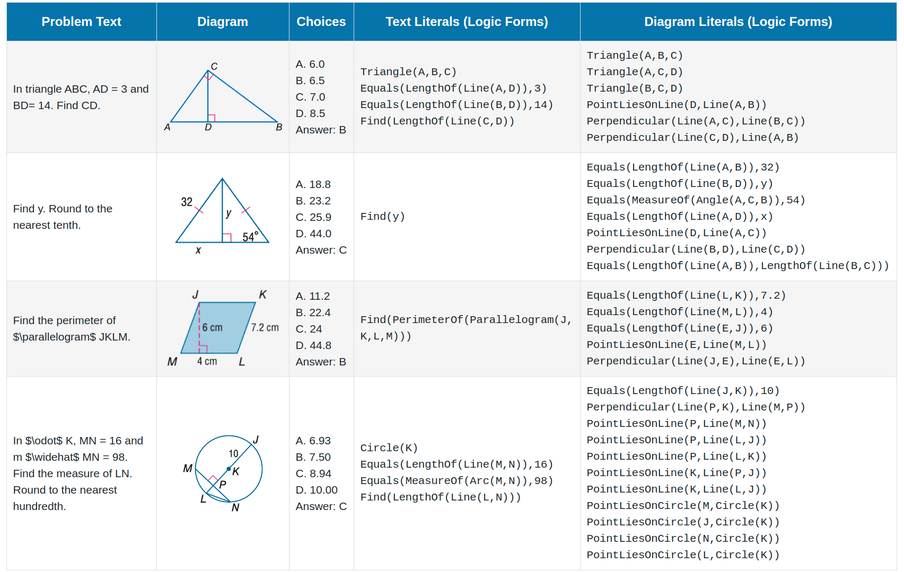

# InterGPS


The core code will be released soon.


## Download the dataset

Four data examples in the *Geometry3K* dataset are shown below:



Download the geometry problem data:

- [Training data](https://lupantech.github.io/inter-gps/geometry3k/train.zip)
  - 2,401 QA pairs
- [Validation data](https://lupantech.github.io/inter-gps/geometry3k/val.zip)
  - 300 QA pairs
- [Testing data](https://lupantech.github.io/inter-gps/geometry3k/test.zip)
  - 601 QA pairs

Download the geometry literal (logic form) data:

- [Literal (logic form) data](https://lupantech.github.io/inter-gps/geometry3k/logic_forms.zip)
  - 6,293 annotated text literals, 27,213 annotated diagram literals

If you have trouble downloading data from the above links, you can alternatively visit the following Google Drive link: [Geometry3K Dataset](https://drive.google.com/drive/folders/1d05WYXtlgKIoaPpK1v94LYph_heiXM7Z?usp=sharing).


## Citation

If the paper or the dataset inspires you, please cite us:

```
@inproceedings{lu2021inter,
  title = {Inter-GPS: Interpretable Geometry Problem Solving with Formal Language and Symbolic Reasoning},
  author = {Lu, Pan and Gong, Ran and Jiang, Shibiao and Qiu, Liang and Huang, Siyuan and Liang, Xiaodan and Zhu, Song-Chun},
  booktitle = {The 59th Annual Meeting of the Association for Computational Linguistics (ACL)},
  year = {2021}
}
```

