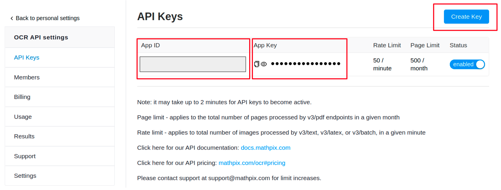

# Diagram Parser

## Introduction

We apply the [RetinaNet](https://github.com/yhenon/pytorch-retinanet) model to detect text regions and symbols from the problem diagrams. The RetinaNet model is fine-tuned on our annotated symbol data before performing detecting. The text regions are then recognized via the [Mathpix OCR](https://mathpix.com/ocr) API to be translated the latex format. Geometry primitives (like points, lines, and arcs) are extracted with the help of the [geosolver](https://github.com/seominjoon/geosolver) tool. Finally, these primitives are grounded with text regions and symbols, and converted to logic forms.

## Fine-tune the detection model

Note that we have annotated each symbol in *Geometry3k*: `../data/geometry3k/symbols`. Preprocess the symbol to prepare the training and test data:

```shell
cd detection
python xml_to_csv.py --annotated_path ../data/geometry3k/symbols
```

It will generate two files:

+   `geometry_labels.csv`: containing training and validation symbol data;
+   `geometry_labels_val.csv`: containing testing symbol data.

We then fine-tune the detection model RetinaNet over the preprocessed data:

```shell
cd detection
python train.py --dataset csv \
--csv_train geometry_labels.csv \
--csv_classes classes.txt \
--csv_val geometry_labels_val.csv \
--output_path models
```

The `classes.txt` lists all types of predefined symbols, like `text`, `angle`, `bar`, `parallel` and so on. The RetinaNet model uses a ResNet backbone. You can set the depth of the ResNet model using the `--depth` argument. The depth must be one of 18, 34, 50, 101 or 152. The checkpoints will be saved in `models`.

## Generate detection results

You can run `script.py` to pick up the best checkpoint over the test data. Then generate detection results for each diagram in test data by loading the best checkpoint. For example, 

```shell
cd detection
python test.py \
--image_dir ../../data/geometry3k/symbols \
--model models/exp0/csv_retinanet_19.pt \
--class_list classes.txt \
--output_path ../detection_results
```

The generated results are saved in two folders in `detection_results`:

+   `box_results`: all detected symbol regions;
+   `ocr_results`: all individual text regions cropped from the diagrams, waiting to be recognized by the optical character recognition tool.

## Text recognition

[MathpixOCR](https://mathpix.com/ocr) provides a strong OCR API for developers to detect diverse types of math expressions. We apply the MathpixOCR to translate the text regions into expressions in LaTex format. To use the OCR API, you need to create a Mathpix account and create an API Key by visiting https://accounts.mathpix.com/ocr-api. For more details about MathpixOCR, please refer to the official user guide [here](https://mathpix.com/docs/ocr/overview).



After creating the API Key, you will get an App ID and an App key shown in the above picture. You need to set the `APP_ID` and `API_Key` in lines 19 and 20 in `mathpix.py`. 

If you complete the configuration of the API successful, run the commands below to generate the OCR recognition results:

```shell
cd ocr_tool
python run_ocr.py
```

You can find the OCR results in `detection_results/ocr_results`.

!!! Note that MathpixOCR is NOT fee and it charges \$0.004 to process one image. It takes about $20 to process all text regions in the test data. If you want to skip this step, you can use our results in `detection_results` directly:

```shell
cd detection_results
unzip -d box_results box_results.zip
unzip -d ocr_results ocr_results.zip
```

## Generate logic forms

Finally, generate diagram logic forms by running the following command:

~~~shell
cd parser
python diagram_parser.py \
--data_path ../../data/geometry3k \
--ocr_path ../detection_results/ocr_results \
--box_path ../detection_results/box_results \
--output_path ../diagram_logic_forms.json
~~~

## Evaluation (Optional)

You can evaluate the generated logic forms compared with the ground truth:

~~~shell
cd evaluation
python calc_diagram_accuracy.py \
--diagram_test ../diagram_logic_forms_pred.json \
--diagram_gt ../../data/geometry3k/logic_forms/diagram_logic_forms_annot.json
~~~
